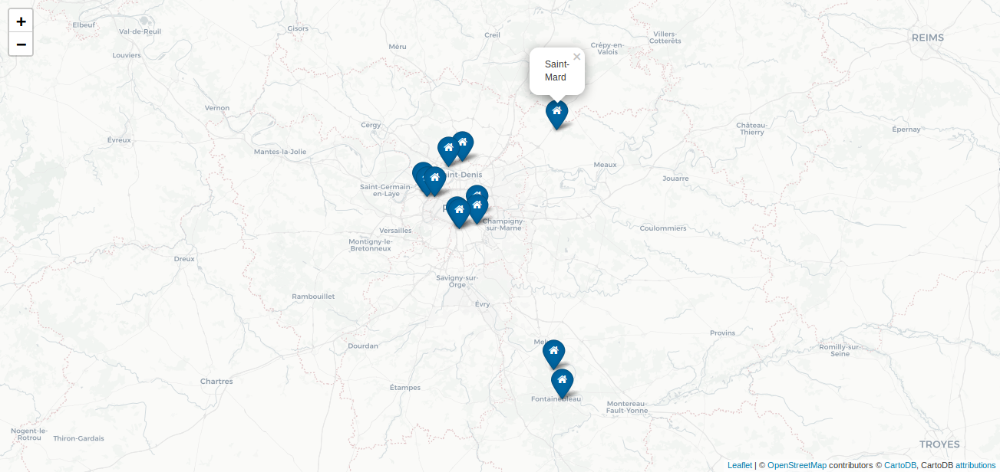
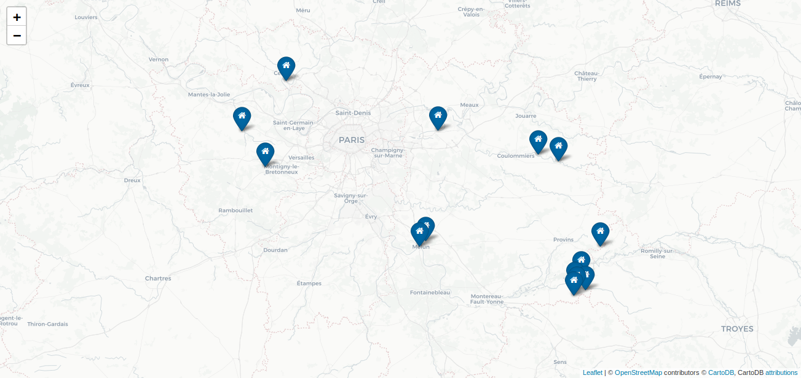
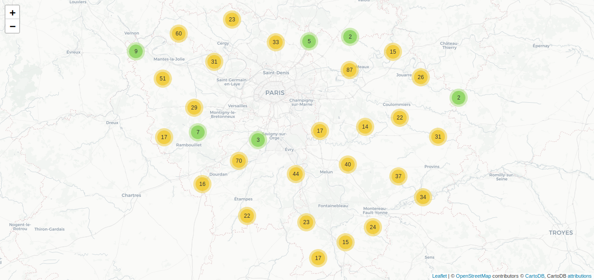

# Chef-d-oeuvre
## Il s'agit du projet de fin de formation utilisant Python, MongoDB et MySQL
### [Télécharger le fichier zip chef_d_oeuvre :inbox_tray:](https://github.com/pzim-devdata/dev-data/raw/master/chef-d'oeuvre/chef_d_oeuvre.zip)

:blue_book:

[Télécharger le rapport:inbox_tray:](https://github.com/pzim-devdata/dev-data/raw/master/chef-d'oeuvre/Rapport.pdf)

Le projet consiste à :

- Scraper sur Wikipédia l'ensemble des villes d'île de France, leurs code postaux et leurs coordonnées (latitude, longitude)
- Scraper grâce à l'API Google Maps les temps de parcours et distances vers Paris en transport en commun, en voiture aux heures de pointes et en trafic normal et en vélo
- Sauvegarder les données non expolitées sur mySQL dans differentes tables, par département, avec en clé étrangère le nom des villes
- Nettoyer les données pour les expoliter et créer de la DataViz pour en dégager une problématique
- Sauvegarder les données assemblées et nettoyées sur MongoDB

----------------------------------

Voici les villes avec les meilleurs ratios :

------------------------------------

Les villes avec les moins bons ratios :

------------------------------------

Et les villes sans transports en commun :

